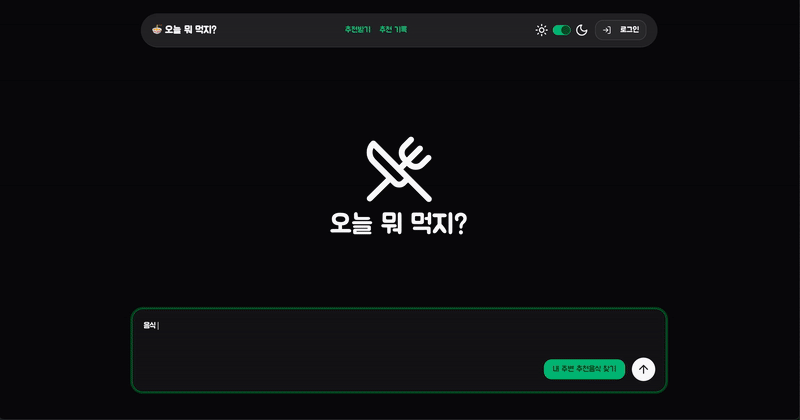
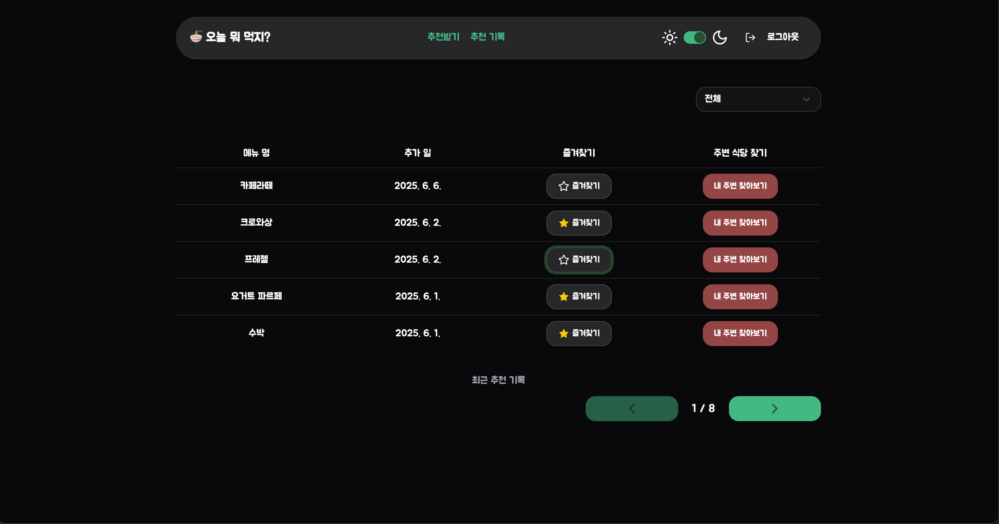
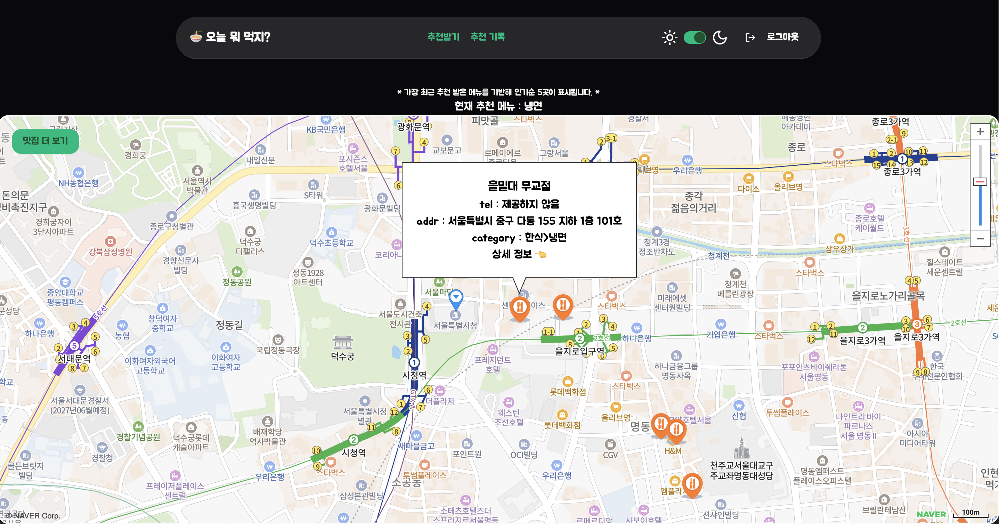

# 오늘 뭐 먹지? 🍜

**AI 프롬프트 기반 메뉴 추천 + 위치 기반 맛집 검색 서비스**
React + Supabase + OpenAI + Naver Map API 기반으로 구현된 실사용 가능한 프로젝트입니다.

<br />

## 📌 소개

> 기분, 날씨, 상황에 맞는 메뉴를 AI에게 추천받고
> 지금 내 위치 근처에서 그 메뉴를 맛볼 수 있는 맛집까지 함께 찾아주는 ✨메뉴 추천 서비스입니다.

- 🤖 프롬프트 기반 메뉴 추천 (OpenAI)
- 📍 내 위치 기반 주변 맛집 검색 (Naver API, Geolocation)
- 🧾 추천 기록 저장 및 즐겨찾기
- 📊 Supabase 기반 실시간 사용자별 데이터 관리

<br />

## 🚀 사용 기술 스택

| 영역           | 기술                                  |
| -------------- | ------------------------------------- |
| Frontend       | React, TypeScript, Vite, Tailwind CSS |
| Backend        | Supabase (DB, Auth, RLS, Storage)     |
| AI             | OpenAI GPT API                        |
| 위치 기반 검색 | Naver Map API                         |
| 배포           | Vercel                                |

<br />

## 🎯 주요 기능

### 1. 메뉴 추천

- 사용자가 프롬프트를 직접 입력
- OpenAI GPT API를 통해 메뉴 + 설명 추천

### 2. 맛집 검색

- 브라우저에서 위치 권한 허용
- 추천된 메뉴 키워드로 Naver API를 통해 근처 가게 검색

### 3. 추천 기록/즐겨찾기

- 추천 히스토리 자동 저장
- 마이페이지에서 전체 추천 내역 & 즐겨찾기 확인

<br />

## 📸 주요 화면

<!-- | 홈 화면       | 추천 결과     | 맛집 리스트   |
| ------------- | ------------- | ------------- |
| __ | __ | __ | -->

|                     홈 화면                     |
| :---------------------------------------------: |
|  |

|                     추천 결과                      |
| :------------------------------------------------: |
|  |

|                  맛집 리스트                   |
| :--------------------------------------------: |
|  |

<br />

## 🧪 트러블슈팅 & 개선 사항

- Supabase RLS를 활용한 사용자별 데이터 접근 제어
- Geolocation + Naver API 연동 시 CORS 및 위치 정확도 이슈 해결
- OpenAI 응답 불확실성 대응 → 프롬프트 템플릿 구조화

<br />

## 📂 프로젝트 구조 (예시)

```bash
📦 src
├── components       # 공통 컴포넌트
├── pages            # 라우팅되는 페이지 단위
├── sercive          # OpenAI, Naver API 호출 함수
├── hooks            # 커스텀 훅 모음
├── supabase         # supabase client & schema 관리
└── types            # 타입 정의
└── store            # Zustand 전역 상태관리

🛠️ 개발 예정 기능 (or 확장 예정)
날씨/기분 자동 감지 기반 추천 프롬프트

친구에게 추천 결과 공유

유저 간 인기 메뉴 랭킹
```

## 🛠 기술 스택 선정 이유

### 📦 React (with Vite + TypeScript)

- **빠른 SPA 구성**: 페이지 간 새로고침 없이 부드러운 전환 UX 구현
- **컴포넌트 단위 개발**: UI 재사용성과 유지보수성 향상
- **Vite**: CRA보다 빠르고 모던한 빌드 환경 제공
- **TypeScript**: 타입 기반 개발로 런타임 오류 감소, 코드 신뢰성 확보

### 📦 Supabase

- **Firebase 대체 오픈소스 BaaS**: 인증, DB, 스토리지 등 통합 제공
- **PostgreSQL 기반**: SQL 직접 사용 가능, 자유도 높은 데이터 설계
- **Row-Level Security(RLS)**: 유저별 데이터 접근 제한으로 보안 강화
- **빠른 MVP 개발 가능**: 별도 서버 없이 즉시 백엔드 구축

### 📦 shadcn/ui

- **컴포넌트 라이브러리 기반 UI**: Tailwind CSS와 유사한 유틸리티 클래스 기반으로 최소한의 스타일링만 제공해, **직접 커스터마이징하기 쉬움**
- **디자인 일관성 유지**: 버튼, 카드, 모달 등 미리 제작된 **재사용 가능한 컴포넌트**를 활용해, 전체 프로젝트의 UI 톤앤매너를 한곳에서 관리
- **Tailwind와 자연스러운 통합**: 이미 Tailwind를 쓰고 있기 때문에, shadcn/ui의 스타일 규칙을 그대로 이용해 **추가 패키지 설치 없이** 일관된 UI 경험을 제공
- **빠른 프로토타이핑**: 자주 쓰이는 패턴(버튼, 입력폼, 모달 등)을 즉시 가져다 쓸 수 있어, **새 기능 개발 속도를 높여 줌**

### 📦 OpenAI GPT API

- **자연어 기반 메뉴 추천**: 사용자 감정/상황에 맞는 창의적 메뉴 제안
- **프롬프트 커스터마이징 가능**: 다양한 입력 조건에 따라 유연한 추천 응답
- **대화형 UX 구성**: AI와 실제로 소통하는 듯한 경험 제공

### 📦 Naver Map API

- **위치 기반 맛집 검색**: 키워드 + 위치 조합으로 주변 장소 검색
- **정확한 가게 정보 제공**: 주소, 거리, 전화번호 등 실용 정보 포함
- **지도 서비스 연계 용이**: Naver Map, Static Map과 자연스럽게 연동 가능

### 📦 Vercel

- **React 프로젝트 배포 최적화**: GitHub 연동만으로 자동 빌드/배포
- **환경 변수 관리 지원**: OpenAI, Supabase 등 API 키 보안 적용 가능
- **CDN 기반 빠른 응답**: 모바일에서도 빠른 초기 로딩 보장
